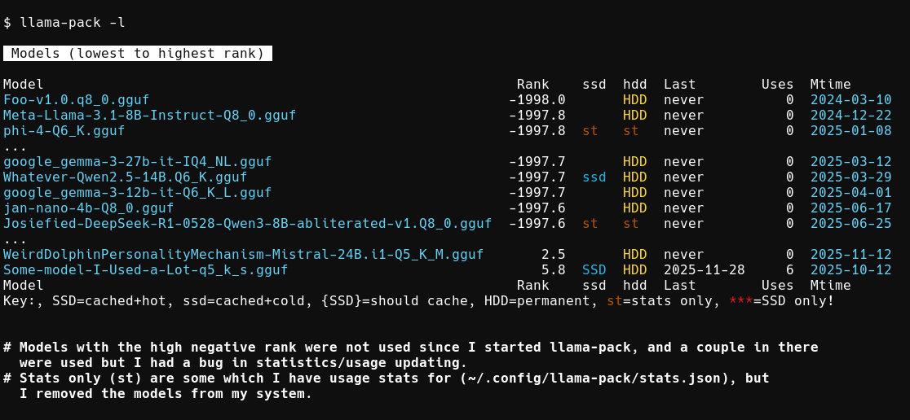

# llama-pack

Smart SSD caching for llama.cpp models. Automatically copies frequently-used models from slow HDD to fast SSD.

Designed so we can support other servers if someone wants to add them.

\[[Quick Start](#quick-start)]
\[[How It Works](#how-it-works)]
\[[Config](#config)]
\[[Full --help](#full--help)]
\[[Tips](#tips)]

<div align="center">
  <em>Overview of <b>llama-pack -l</b></em><br>
  <br>
</div>

## Quick Start
```bash
# Alias for convenience
alias llp=llama-pack

# First run creates default config
llp --update
# Edit ~/.config/llama-pack/config.json - set your ssd_path, hdd_path, and server_binary
# ...or...
lpp --ec  # Will pop up editor on config with $EDITOR // vim

# Scan your model directories
llp --update

# Load a model by partial name match
llp -m gemma5
# Finds "Gemma2-9B-Q5_K.gguf" if it's the only match, starts llama-server

# Override llama-server args once
llp -m gemma5 -- -c 8192

# Store custom args for this model permanently
llp -m gemma5 --store -- -c 8192 -ngl 40
# Next time: llp -m gemma5 uses stored args automatically

# After a few uses, model gets cached to SSD
llp -m gemma5
# [Detected multiple recent uses, copying to SSD in background...]
# [Server starts from HDD while copy happens]

# Next run loads from SSD (faster!)
llp -m gemma5
# [Loading from SSD: ~/.../models/ssd/Gemma2-9B-Q5_K.gguf]

# Kill running server
llp -k
# Or kill all: llp --killall

# List all models with stats
llp -l
# Shows: rank, SSD/HDD status, usage stats, last used date
# SSD = cached & hot, {SSD} = should cache, HDD = permanent storage, st = stats only

# Show currently running servers
llp --status
```

## How It Works

- **Automatic caching**: 3+ uses within 7 days → copies to SSD
- **Smart expiry**: Low-ranked models removed from SSD when space is tight
- **Rank-based loading**: Multiple matches? Picks most recently/frequently used
- **Per-model args**: Store custom llama-server flags per model with `--store`

## Config

Edit `~/.config/llama-pack/config.json`:
- `ssd_path` / `hdd_path`: Where models live
- `ssd_min_free_gb`: Minimum free space to maintain on SSD
- `global_llama_args`: Args passed to ALL models
- `server_binary`: Path to llama-server binary

## Full --help

```
llama-pack: Manage and load LLM models with smart SSD caching.

RUNNING MODELS:
  -m, --model NAME     Load model by name/pattern
  -p, --port N         Server port (default: 8080)
  --host ADDR          Server host (default: 127.0.0.1, use 0.0.0.0 for all interfaces)
  --store, --keep      Save model-specific args for future runs
MANAGING MODELS:
  -l, --list           List all models with stats and rankings
  -u, --update         Scan directories and update model index
  --status, --stat     Show currently running servers
  --st
  --ec --ce --edit-config  Edit, like: vim config_file
                       (Uses env var $EDITOR)
KILLING SERVERS:
  -k, --kill           Kill server on specified port (use with -p/--port)
  --killall, --kall    Kill ALL llama-pack managed servers
SIMULATION:
  --simulate NAME      Run named simulation preset from config
  --simulate PATTERN   Run custom simulation pattern (contains = or ;)
  --sim-ssd-free SIZE  Override SSD free space (e.g. 50g, 100m, 1.5g)
OTHER:
  -v, --verbose        Increase verbosity (use multiple times: -v -v)
  -h, --help           This help
  --                   Everything after this goes to llama-server

EXAMPLES:
  llama-pack -m mymodel                    # Load model with saved args
  llama-pack -m mymodel -- -c 8192         # Override context size once
  llama-pack -m mymodel --store -- -c 8192 # Save new context size
  llama-pack -k -p 8080                    # Kill server on port 8080
  llama-pack --killall                     # Kill all running servers
  llama-pack --status                      # Show what's running
  llama-pack --simulate daily_work         # Run simulation preset
  llama-pack --simulate "test:10g=0s/1h,1d/2h" --sim-ssd-free 50g

*Note: Simulation preset names may not contain = or ;

CONFIG: /home/user/.config/llama-pack/config.json
```

## Tips

Run with `-v` for verbose output showing paths and decisions.
Run with `-v -v` for even more detail.

```
Gemma2-9B-Q5_K.gguf
   6.5  SSD  hdd  2025-11-28    6  2025-11-20
   ssd: /home/user/.../models/ssd/Gemma2-9B-Q5_K.gguf
   hdd: /home/user/.../models/hdd/llm/Gemma2-9B-Q5_K.gguf
```
